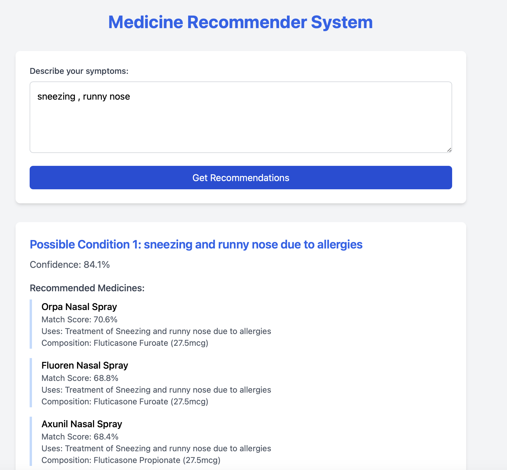

# Medicine Recommendation System 🏥

## Overview
A sophisticated recommendation system that helps users find appropriate medicines based on symptoms and other relevant factors. This system utilizes machine learning algorithms to provide accurate and personalized medicine recommendations.



## Features
- Symptom-based medicine recommendation
- Smart filtering based on user's medical history
- Interactive user interface
- Data-driven recommendations
- Visualization of recommendation patterns

## Installation

### Prerequisites
- Python 3.7+
- pip package manager

### Setup
1. Clone the repository

bash
git clone https://github.com/ackerman23/Medicine-Recommendation-System
cd Medicine-Recommendation-System

2. Create and activate virtual environment
```bash
python -m venv medicine_rec
source medicine_rec/bin/activate  # For Unix/macOS
# OR
medicine_rec\Scripts\activate  # For Windows
```

3. Install required packages
```bash
pip install -r requirements.txt
```

## Required Dependencies
- matplotlib
- pandas
- numpy
- scikit-learn
- flask (for web interface)

## Usage
1. Start the application:
```bash
python app/app.py
```

2. Access the web interface at `http://localhost:5000`

## Project Structure
```
Medicine-Recommendation-System/
├── app/
│   ├── app.py
│   ├── utils.py
│   └── models/
├── data/
│   └── medicine_dataset.csv
├── tests/
├── requirements.txt
└── README.md
```

## How It Works
The system uses a combination of collaborative filtering and content-based filtering to recommend medicines:
1. Analyzes user symptoms
2. Matches symptoms with medicine database
3. Considers factors like:
   - Previous prescriptions
   - Known allergies
   - Medicine effectiveness
   - User demographics

## Contributing
Contributions are welcome! Please feel free to submit a Pull Request.

1. Fork the repository
2. Create your feature branch (`git checkout -b feature/AmazingFeature`)
3. Commit your changes (`git commit -m 'Add some AmazingFeature'`)
4. Push to the branch (`git push origin feature/AmazingFeature`)
5. Open a Pull Request

## Safety Notice ⚠️
This system is designed to provide recommendations only. Always consult with a qualified healthcare professional before taking any medication.

## License
This project is licensed under the MIT License - see the [LICENSE](LICENSE) file for details.

## Contact
Your Name - jihad.garti2@gmail.com
Project Link: https://github.com/ackerman23/Medicine-Recommendation-System
## Acknowledgments
- List any resources, libraries, or individuals you'd like to credit
- Dataset : "https://www.kaggle.com/datasets/aadyasingh55/drug-dataset"
- Any research papers or studies that influenced your approach
- Dataset sources and contributors